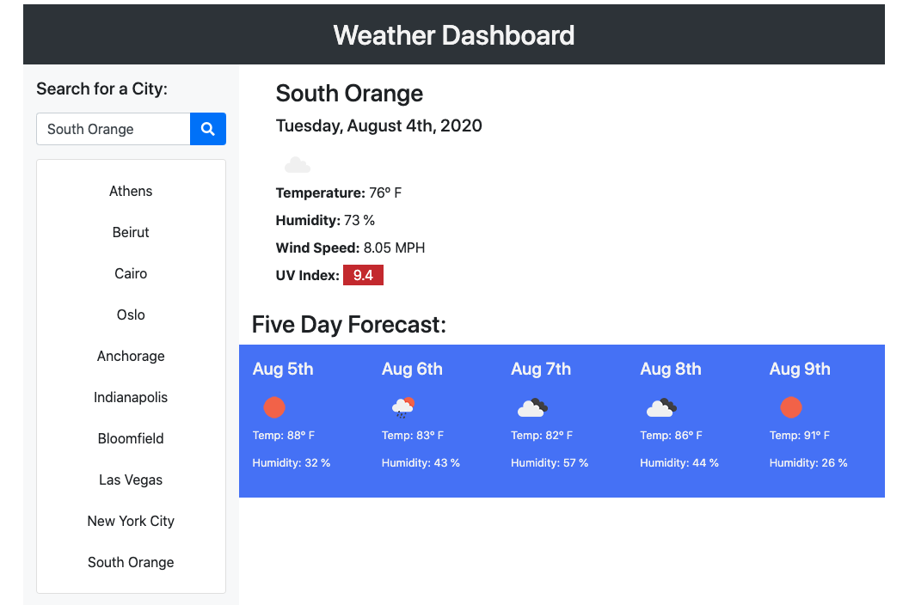

## Weather Dashboard
### Homework Assignment 6
#### RUT-JER-FSF-PT-06-2020-U-C

Assignment: create a weather dashboard using a third party API to return information.
When inputting a city into the search field you receive the following results:

- The current weather of the city searched.
- The current date.
- The weather displayed in an icon.
- The current temperature, humidity, wind speed and color coded UV Index.
- A five day weather forecast.

A functioning button is rendered under the search field for each city searched and stored in localStorage with the most recent search on the top of the list.
Buttons will remain despite navigating away from the page or reloading it.

***Languages:***
HTML
CSS & Bootstrap
JavaScript
jQuery
Ajax

***Links:***
[Application]()
[Github](https://github.com/BwayCarl/weather-dashboard)
